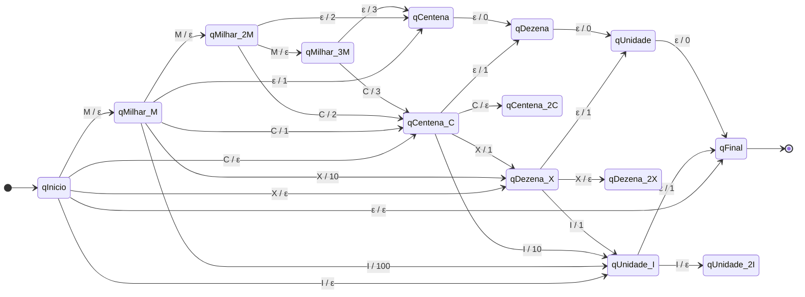

# (EP): Transdutor Finito Determinístico - Numerais Romanos

**Instituição:** Centro Universitário Senac

**Autores:** Eric Donato, Matheus Henrique, Paula Martins

**Disciplina:** Linguagens Formais e Autômatos

Este projeto implementa um Transdutor Finito Determinístico capaz de reconhecer numerais romanos (de I a MMMCMXCIX) e convertê-los para o sistema decimal indo-arábico. A conversão é feita exclusivamente através de transições de estado, sem o uso de variáveis acumuladoras ou bibliotecas de máquina de estado, conforme as exigências da disciplina.

---

## 1. Modelagem AFD - Transdutor

### Definição Formal
O modelo implementado é definido formalmente por uma sêxtupla $T = (Q, \Sigma, \Gamma, \delta, \lambda, q_0)$, onde:

* **$Q$ (Conjunto finito de estados):** `{qInicio, qMilhar_M, qCentena_C, qDezena_X, qUnidade_I, ..., qFinal}`
* **$\Sigma$ (Alfabeto de entrada):** `{I, V, X, L, C, D, M, ε}` *(onde ε é a string vazia, indicando o fim da cadeia)*
* **$\Gamma$ (Alfabeto de saída):** `{0, 1, 2, 3, 4, 5, 6, 7, 8, 9}`
* **$\delta$ (Função de transição de estados):** $Q \times \Sigma \rightarrow Q$
* **$\lambda$ (Função de saída):** $Q \times \Sigma \rightarrow \Gamma^*$
* **$q_0$ (Estado inicial):** `qInicio`

### Tipo de Transdutor: Máquina de Mealy
A implementação utiliza o modelo de **Transdutor de Mealy**. A principal característica de uma Máquina de Mealy é que suas saídas são determinadas pela combinação do **estado atual e da entrada atual** (ou seja, a saída está associada à transição). 

**Por que Mealy?**
Ao ler um número romano, não podemos emitir o valor correspondente assim que entramos em um estado, pois o valor do símbolo depende do caractere subsequente (regra de subtração). Por exemplo, estando no estado `qCentena_C` e lendo a entrada `X`, o sistema emite `1` (pois confirmamos que o `C` vale 100). No entanto, se a partir do mesmo estado a entrada for `I`, o sistema emite `10`. Como a saída muda dependendo da transição tomada a partir do mesmo estado, o modelo de Mealy é o único viável para essa conversão algarismo a algarismo.

### Entradas e Transições de Estado

* **Transições sem emissão de símbolo no alfabeto de saída:**
  Ocorrem quando o transdutor precisa "acumular" conhecimento posicional e não pode afirmar o valor decimal ainda.
  * *Exemplo:* `qInicio` lendo `M` $\rightarrow$ vai para `qMilhar_M` (Não emite saída).
  * *Exemplo:* `qCentena_C` lendo `C` $\rightarrow$ vai para `qCentena_2C` (Não emite saída).

* **Transições com emissão de símbolo no alfabeto de saída:**
  Ocorrem quando a leitura de um símbolo menor valida o peso do(s) símbolo(s) lido(s) anteriormente, ou quando ocorre o fim da fita ("cascata de zeros").
  * *Exemplo:* `qMilhar_M` lendo `X` $\rightarrow$ vai para `qDezena_X` | Emite saída: `10`
  * *Exemplo:* `qDezena_X` lendo `I` $\rightarrow$ vai para `qUnidade_I` | Emite saída: `1`
  * *Exemplo:* `qCentena` lendo `ε` $\rightarrow$ vai para `qDezena` | Emite saída: `0` (Fim de fita preenchendo a casa decimal vazia).

---

## 2. Diagrama de Estados (Mermaid)

Para visualizar o fluxo, o diagrama Mermaid completo encontra-se no diretório `/docs`. Abaixo está uma representação simplificada contemplando o caminho principal das validações e o fluxo de encerramento de fita (cascata de zeros).



---

## 3. Como Executar

Este projeto foi desenvolvido na linguagem Ruby.

1. Clone este repositório.
2. Navegue até o diretório do projeto no terminal.
3. Execute o arquivo principal:
   ```bash
   ruby transdutor_romano.rb
   ```
4. Digite o número romano desejado (Ex: `MMXXIV`) e acompanhe a transição dos estados e a emissão das saídas decimais parciais até a aceitação final.
