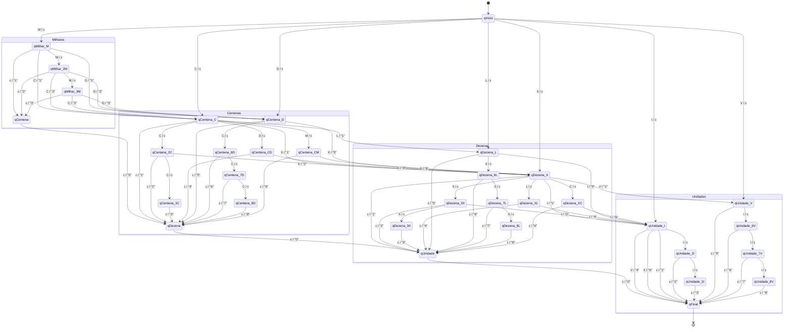

# Modelagem AFD - Transdutor 3.0

Este documento detalha a modelagem matemática e lógica do Autómato Finito Determinístico (AFD) com saída (Transdutor) desenvolvido para a conversão de numerais romanos para decimais.

## 1. Definição Formal

O modelo implementado é definido formalmente por uma sêxtupla $T = (Q, \Sigma, \Gamma, \delta, \lambda, q_0)$, onde:

* **$Q$ (Conjunto finito de estados):** `{qInicio, qMilhar_M, qMilhar_2M, qMilhar_3M, qCentena_C, qCentena_2C, qCentena_3C, qCentena_CD, qCentena_D, qCentena_6D, qCentena_7D, qCentena_8D, qCentena_CM, qCentena, qDezena_X, qDezena_2X, qDezena_3X, qDezena_XL, qDezena_L, qDezena_6L, qDezena_7L, qDezena_8L, qDezena_XC, qDezena, qUnidade_I, qUnidade_2I, qUnidade_3I, qUnidade_V, qUnidade_6V, qUnidade_7V, qUnidade_8V, qUnidade, qFinal}`
* **$\Sigma$ (Alfabeto de entrada):** `{I, V, X, L, C, D, M, ε}` *(onde ε representa a string vazia ou fim da cadeia)*
* **$\Gamma$ (Alfabeto de saída):** `{0, 1, 2, 3, 4, 5, 6, 7, 8, 9}`
* **$\delta$ (Função de transição de estados):** $Q \times \Sigma \rightarrow Q$
* **$\lambda$ (Função de saída):** $Q \times \Sigma \rightarrow \Gamma^*$
* **$q_0$ (Estado inicial):** `qInicio`

## 2. Tipo de Transdutor: Máquina de Mealy

A arquitetura escolhida para a resolução deste problema é a **Máquina de Mealy**. 

A justificação para esta escolha reside na regra fundamental da numeração romana: o valor posicional de um símbolo pode ser aditivo ou subtrativo dependendo do símbolo que o sucede. Numa Máquina de Moore, a saída está associada unicamente ao estado atual. Contudo, no nosso transdutor, o simples facto de estarmos no estado `qCentena_C` (após ler um "C") não é suficiente para determinar a saída. 

Se a transição seguinte for a leitura de um "X", sabemos que o "C" valia efetivamente 100, emitindo a saída `1`. Se a transição seguinte for a leitura de um "M", o "C" funcionou como subtrator (CM = 900), emitindo a saída `9`. Como **a saída depende crucialmente da transição (estado atual + símbolo de entrada)**, o modelo de Mealy adequa-se de forma perfeita.

## 3. Comportamento das Transições

### Transições sem alfabeto de saída
Representam momentos em que o autómato avança na fita, mas ainda não tem informação suficiente para determinar o dígito decimal, alterando apenas o seu estado interno de conhecimento.
* **Exemplo 1:** Estando em `qInicio`, ao ler `M`, transita para `qMilhar_M`. Nenhuma saída é emitida.
* **Exemplo 2:** Estando em `qCentena_C`, ao ler `D`, transita para `qCentena_CD`. Nenhuma saída é emitida (preparação para emitir o "4" na próxima etapa).

### Transições com emissão de símbolos
Ocorrem quando a leitura de um novo símbolo confirma o bloco de grandeza anterior, ou quando ocorre a terminação da fita.
* **Exemplo 1:** Estando em `qCentena_C`, ao ler `X` (iniciando as dezenas), transita para `qDezena_X` e emite `1` no alfabeto de saída (confirmando a centena "1").
* **Exemplo 2:** Estando em `qCentena`, ao ler `ε` (fim de cadeia), transita para `qDezena` e emite `0` (Cascata de Zeros, preenchendo casas decimais inexistentes à direita).

---

## 4. Diagrama de Estados (Mermaid)

Abaixo encontra-se a representação gráfica do nosso Transdutor de Mealy, mapeando as validações de grande parte da cadeia (Milhares, Centenas, Dezenas, Unidades e Cascata de Zeros). As transições seguem o formato `Entrada / Saída` (onde `ε` significa ausência de entrada/saída).

